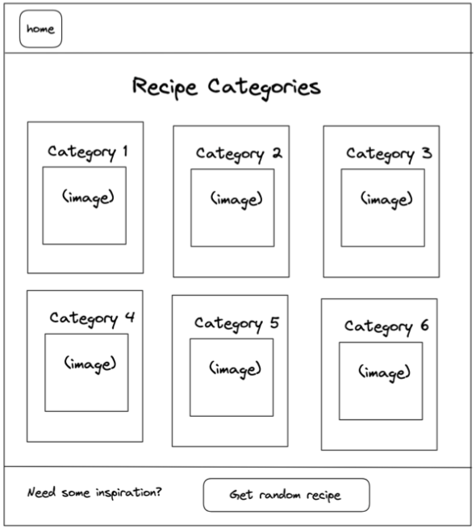
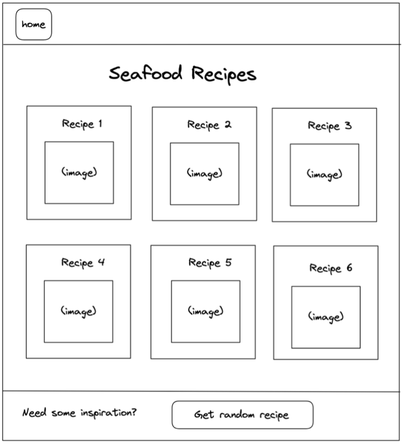
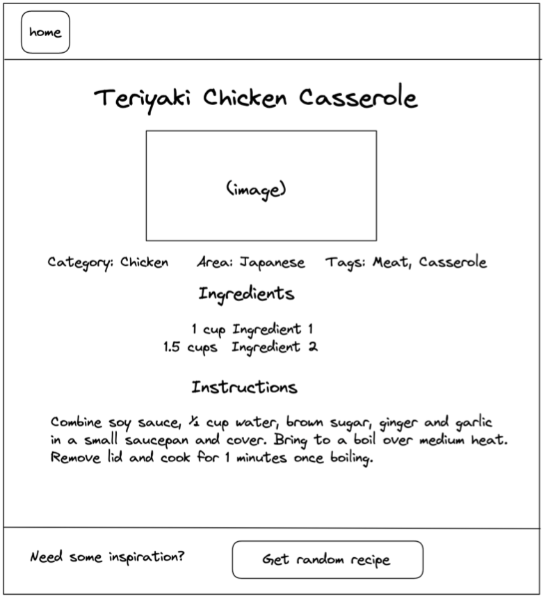
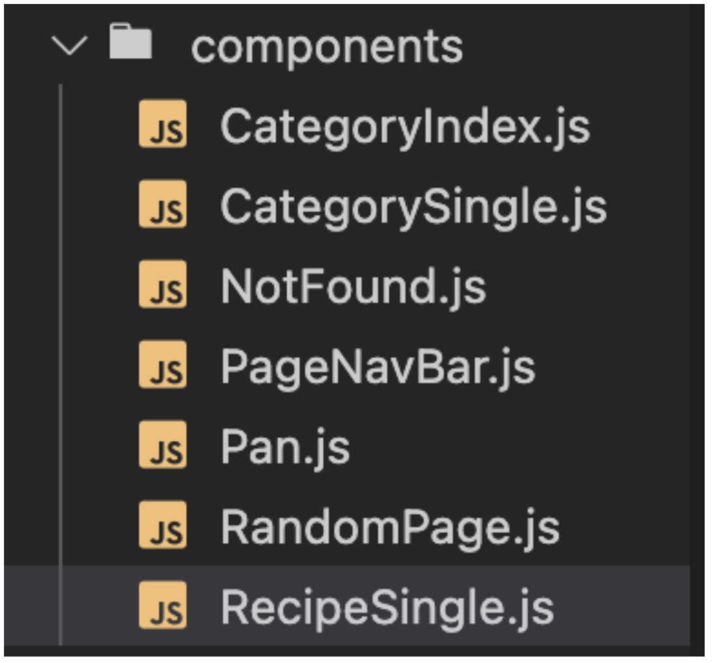
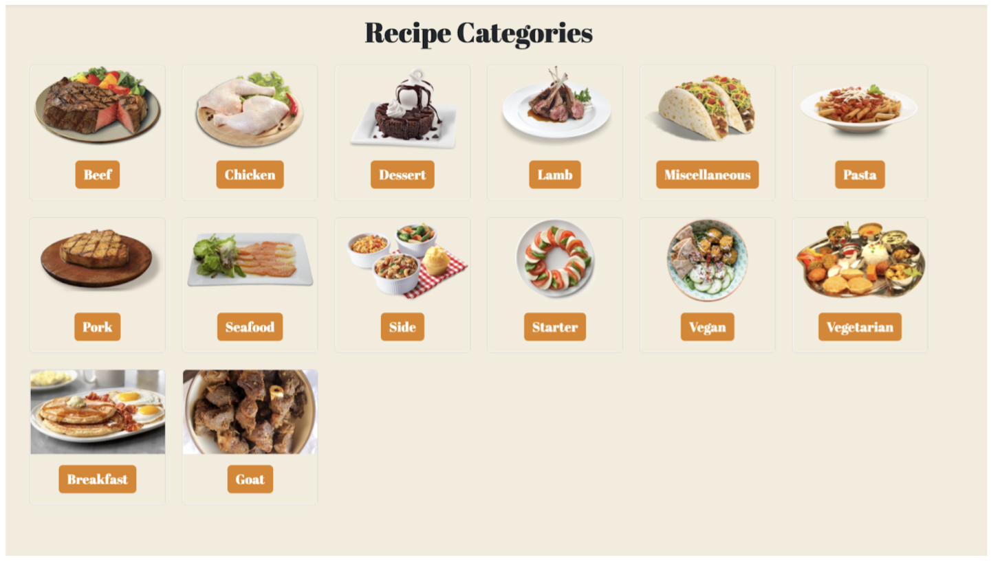
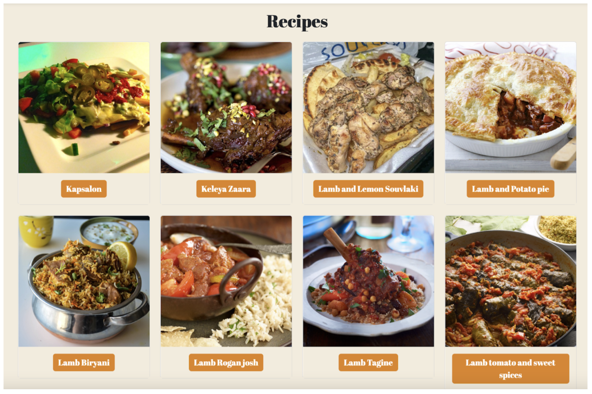
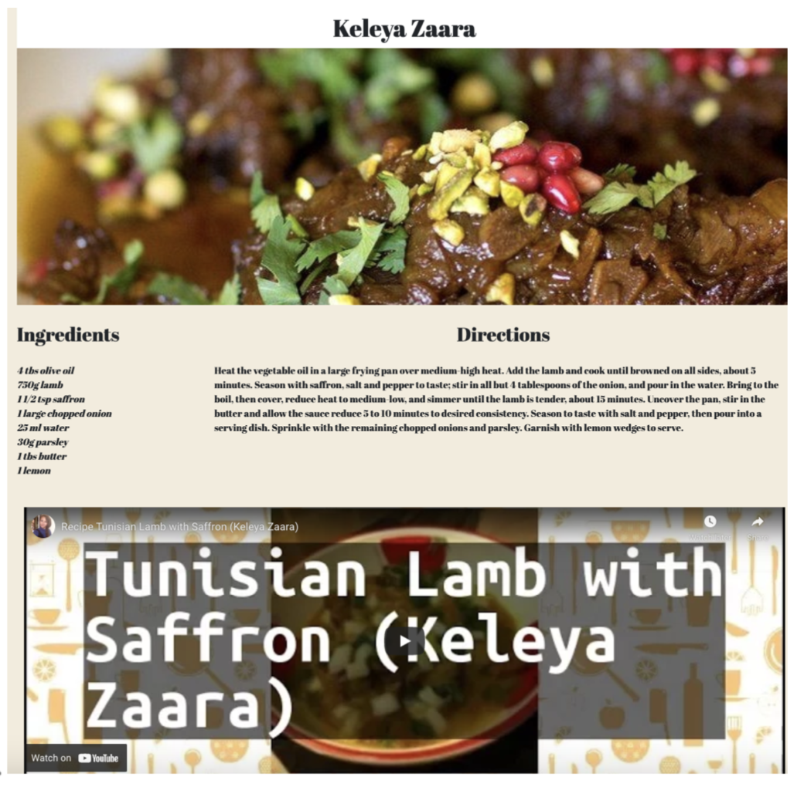
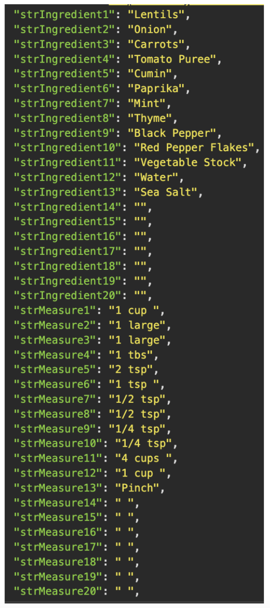
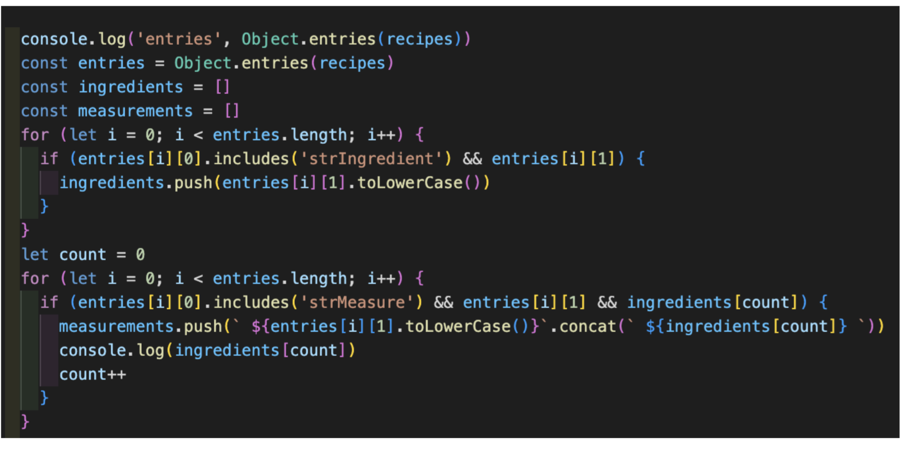
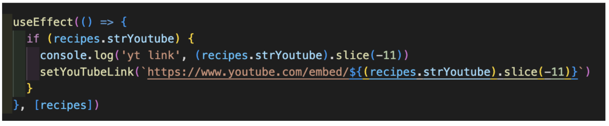

## DescriptionDescription

After 2 weeks of learning React, Bootstrap and how to work with APIs, we were set a paired project (to be completed in under two days) with a brief of creating a React application, containing components which consumed a public API. We were told that if we were feeling ambitious our page could include Routers. 

## Deployment Link 

https://react-recipe-app-2-day-project.netlify.app/

## Overview

## Timeframe & Working Team

We had just under two days to complete this assignment and I worked with Kate (https://github.com/kdshea/) who is also on the General Assembly programme.

## Technologies Used
 
JavaScript
HTML
CSS
Slack
React
React - Bootstrap
Insomnia
VSCode Liveshare
GitHub
Netlify
Excalidraw

## Wireframes

Home Page -> (with footer in Navbar instead of at bottom of page)

Filtered Page (either navbar or a filter on homepage)
(Recipes filtered by category) (with footer in Navbar instead of at bottom of page)

When a card is clicked
Recipe clicked from filtered category page
(with footer in Navbar instead of at bottom of page)

## Components
NotFound

RecipeSingle
www.themealdb.com/api/json/v1/1/lookup.php?i= :id
(example: www.themealdb.com/api/json/v1/1/lookup.php?i=52772)

PageNavbar

RandomPage
www.themealdb.com/api/json/v1/1/random.php

Home: CategoryIndex
List of categories with thumbnails: www.themealdb.com/api/json/v1/1/categories.php

## Plan

We worked on Zoom, Google Meet, WhatsApp and Excalidraw. We pair-coded for the whole of this project using VSCode LiveShare. 

For our initial plan we set ourselves a series of tasks which needed to be completed. These tasks were:

- Link App.js and Index.js
- Set up our routes/ BrowserRouter in the App.js and import our components
- Create components which all contain a different tag just to check they are linked and working
- Create a PageNavbar that links to the homepage
- Create links on Insomnia for our API (themealDB) and copy these into our frontend
- Make cards using one recipe category and apply Bootstrap CSS on that one recipe category, then once we’re happy with the CSS, we can use an async function with a  try catch to import our data, and swap our recipe category’s data to the imported data (e.g. swap Desert to { strCategory }) 
- We need to display the name of the category (strCategory), a picture (strCategoryThumb) and we will need its ID for the key (idCategory) 
- Create filters (by strCategory)  
- With the filters we’re going to use useParams() but we need to play around with it to be 100% sure of what information we’re going to be saving. Our key will be category and our value will be the one they chose.  
- Individual Page (RecipeSingle component) has strMeal, strMealThumb and strInstructions
- We need to do a check on if strIngredients and strMeasure exists, and if it does we display it. 
- We can do a loop so that it runs as many times as ingredients there are so we don’t have to manually write out 20 tests.
- As a stretch, we can use random.php to find a random recipe. 

We were asked to pair-code for the whole project and we chose to use VSCode LiveShare to collaborate.

## Build/ Code process

We split our project into several components.

Category Index acted as our home page and it showed all the different categories of food in our API.

The person accessing our project was encouraged to click on one of the categories which would lead them to our CategorySingle component.

Within CategorySingle, we filtered the recipes and displayed only the recipes whose category matched the category selected in CategoryIndex. For example, below is the result of selecting Lamb in CategoryIndex.

When the user selected a recipe, they were directed to the RecipeSingle component. Within Recipe Single, we displayed the recipe name, measurements, ingredients, instructions and an embedded YouTube video.

We also added a navbar to allow quick navigation between our components, a home button which links to CategoryIndex and a randomRecipe which uses navigate() and useNavigate to automatically redirect to a random recipe.

## Challenges

One of the main challenges was that we wanted our method for displaying strIngredient and strMeasure to be dynamic. Instead of having 40 lines (including a test if the element existed), we thought we could use a few lines to achieve the same result. 

We turned these objects into an array so we could apply array methods. 

We then mapped through ingredients, firstly checking if the ingredient was truthy (existed) and then pushed it to a new empty array (ingredients). We then created a new count and repeated the process for measure. This meant we were left with an array which showed our ingredients and measurements and only showed them when they existed.

Another challenge was getting our YouTube videos to embed. We wanted to embed them because an embedded video looks better than YouTube links, and it also meant that the user would be encouraged to stay on our page. 

We used Slice() to take the last 11 characters from the end of the youtube URLs

We inserted our YouTube link into the HTML code provided by YouTube to embed videos. 

## Bugs

When entering a URL that starts with https://react-recipe-app-2-day-project.netlify.app/a/ it won’t take you to our error page, but instead it displays a blank page.

Some YouTube videos, provided by the API, have since been deleted or made private. 

## Wins

This was the first project where we worked with a backend and we were given complete freedom to find an API we were interested in. We liked this one because it had so many routes to play around with and gave us a lot of space to create an interesting website. We used our index of types of foods, to take us to an index of recipes within that cuisine and finally a single recipe page. We also had a random recipe page to take us to a single recipe page. This meant that our website felt full. A big win was that the fullness of our website naturally led to multiple routes - having routes at all was something we considered to be a “nice to have” feature. 

Another win was that we were able to complete this project almost entirely independently, we were shown how to use react only a few days before we started this project, and were able to apply our knowledge with minimal assistance from our instructors, only needing help with deploying our final project - which is understandable as it was our first time using Netlify. 

## Key Learnings and Takeaways

It was great to practise using React and Bootstrap. I also enjoyed the freedom of being able to find an API and then learning how to access an API I was unfamiliar with.

There were two main takeaways for me, working in a group and working with a backend:

## Working in a group:

On General Assembly, the majority of homework was completed independently, our first project was completed independently and whilst I might have worked with other people in class, it was rare to complete every step of a project together. This was the first project where everything from the initial plan to the final line of code written, was done as a pair. This meant that we learnt how to sort the logistics of working together - made more challenging living in different continents! We worked over WhatsApp, Slack, Google Meet, Excalidraw, iMessage, Zoom  and Google Drive - it felt like we used everything. Eventually we found VSCode LiveShare, which combined with Zoom, allowed us to work extremely well together. We could show the other person what we were thinking on VSCode Live Share and share our ideas on Zoom before we started coding. 

As well as the logistics of working remotely, I learnt a lot from Kate, her planning was detailed, she kept all the steps very simple, and unlike my Project 1 - there was a huge focus on making our website mobile friendly. 

I also learnt more about APIs. The process of finding our API meant that we searched through websites such as https://mixedanalytics.com/blog/list-actually-free-open-no-auth-needed-apis/ and https://rapidapi.com/collection/list-of-free-apis. This process showed me the kind of project where an API is most commonly used and exploring further showed me the range of uses they can have. 

## Future Improvements
 
I would like to have included  a search function in some capacity. I think it would have made most sense to be able to search by ingredient so that you can cook based on the food you already have. 